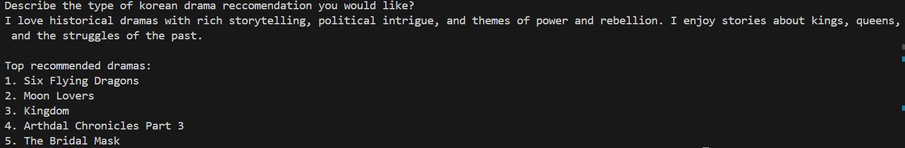

# AI/Machine Learning Intern Challenge: Simple Content-Based Recommendation

## Overview
An k-drama reccomendation system built using natural langauge processing technqiues. The system reccomends you the top 5 kdramas that match the preference you give the system. 

An example of an request: "Romantic comedy with strong friendships love story humorous strong bond companionship"

The dataset was pulled from: https://www.kaggle.com/datasets/chanoncharuchinda/top-100-korean-drama-mydramalist . It can be directly downloaded from the site attached or from under the `Dataset` folder, file name: `top100_kdrama`

## Environment Set-up
Python version used: 3.13
1. Create virtual environment
   `python -m venv myenv`
2. Download all the necessary packages
   `pip install -r dependencies.txt`
   Update pip if necessary: `python.exe -m pip install --upgrade pip`
3. Run your code
   `python main.py`
4. Results
   

## Salary Expectations
Around $4000
